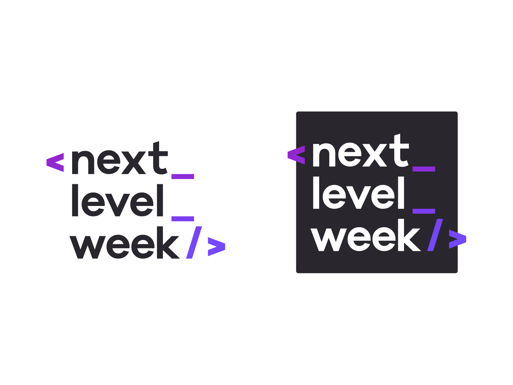</img>

<h1 align="center">Next Level Week</h1>
<p align="center">Projeto <strong>Ecoleta</strong> da <strong>Rocketseat</strong></p>

# Sobre o projeto

Projeto desenvolvido tendo em mente a semana do meio ambiente.
O objetivo é criar um sistema que integre empresas de coletas e pessoas que querem dar um destino apropriado ao seu lixo.

O instrutor do projeto, como sempre, é o <a href="https://github.com/diego3g">Diego</a>.

Nesse projeto foi usado o framework <a href="http://knexjs.org/">Knex.js</a>. Além disso, usamos o <a href="https://www.npmjs.com/package/sqlite3">SQLite3</a> como banco de dados.

<a href="https://insomnia.rest/">Insomnia</a> foi usado para testar as rotas do backend.
Exportei as configurações usadas no projeto. Sinta-se livre para testa-las.

React e React Native são os frameworks do front-end. Typescript está sendo usado juntamente para garantir um código mais legível.

<a href="https://expo.io/">Expo</a> foi usado para a criação da parte mobile, por motivos práticos.


# Instalação

Baixe os arquivos do projeto, e dentro de cada pasta, digite :

```
npm install / yarn install
```

Esse comando irá instalar as dependências de cada projeto.

# API Rest

```` npm run dev / yarn dev ```` para iniciar o servidor. Servidor rodando na porta **3333**

Como não estou enviando o arquivo do banco de dados, você terá que gera-lo em sua própria máquina:

Digite em sua cmd ```` npm run knex:migrate ```` para gerar as tabelas do banco de dados.
Em seguida, ```` npm run knex:seed ```` para gerar os items coletáveis no banco de dados.

-----------------

Na pasta controllers/PointsController.ts, e em ItemsController.ts existe uma configuração para a conexão com a porta local do seu computador:

````
...

        ...point,
        image_url: `http://192.168.2.15:3333/uploads/${point.image}`

...
````

Troque o ip pelo seu próprio para que o projeto possa rodar em sua máquina.

Os pontos de coleta terão suas imagens guardadas na pasta uploads.


# Web

```` npm run start / yarn start ```` para inicar o projeto React.

------

**Página inicial:**

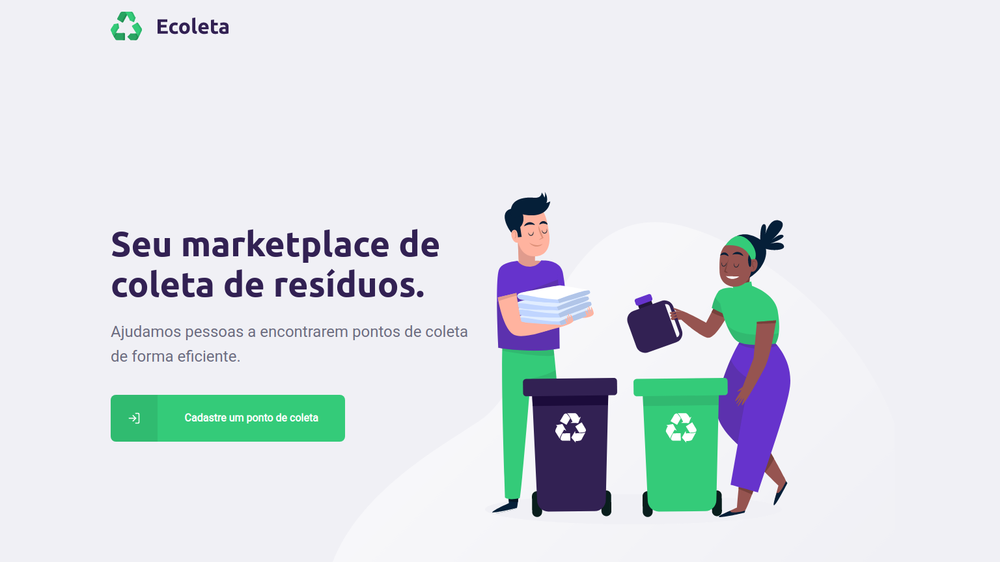</img>

**Página de cadastro:**

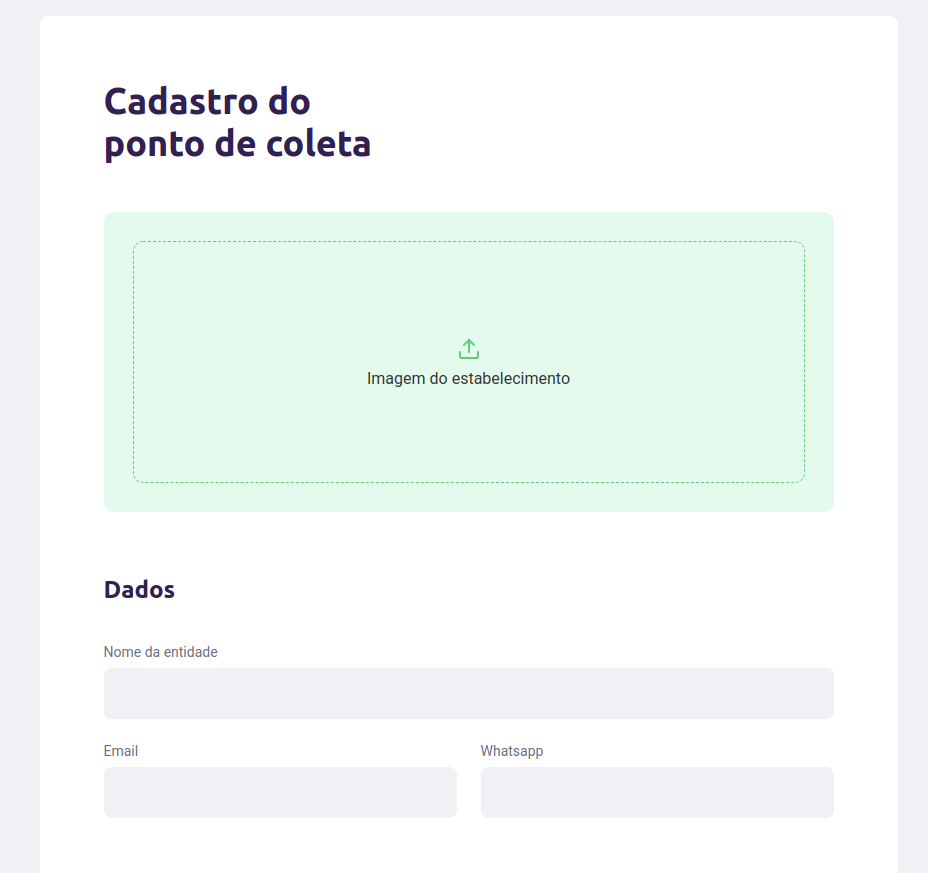</img>

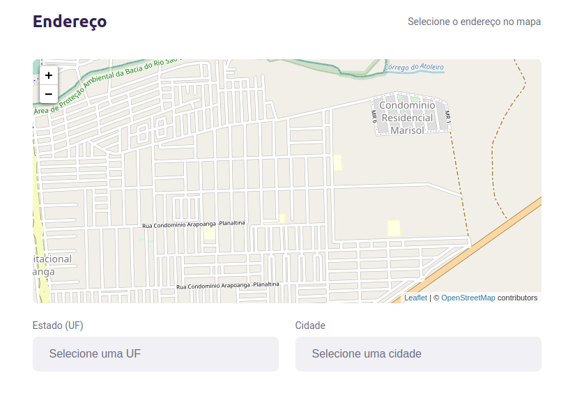</img>

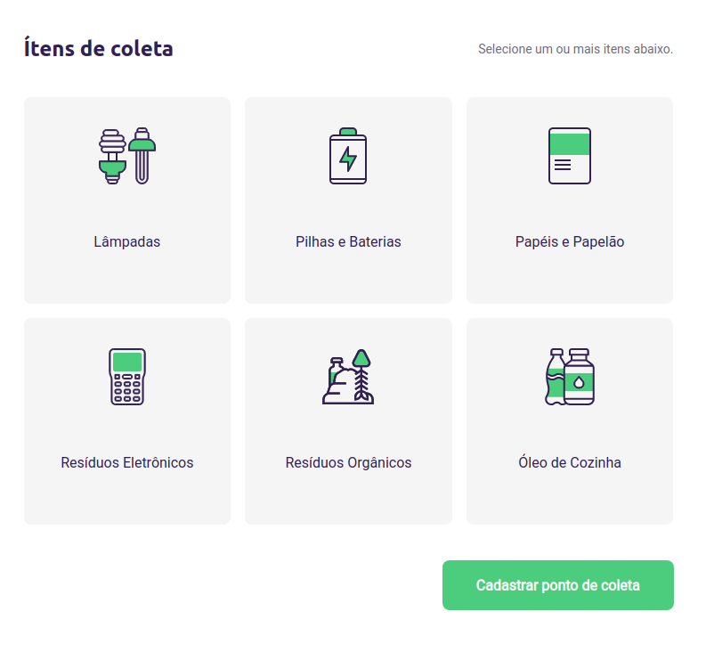</img>

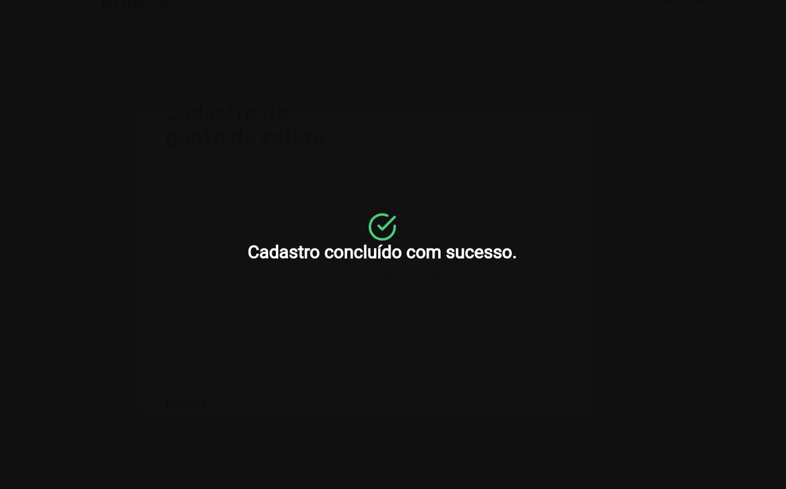</img>


# Mobile

```` npm run start / yarn start ```` para iniciar o Expo. Aguarde alguns segundos, e a página de interface do expo irá abrir.

-----

**Página inicial:**

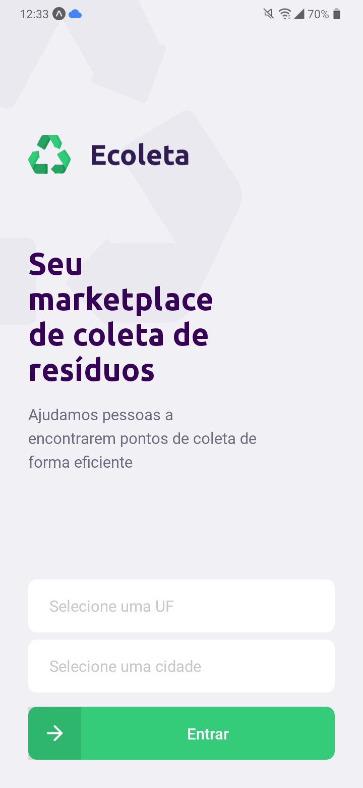</img>

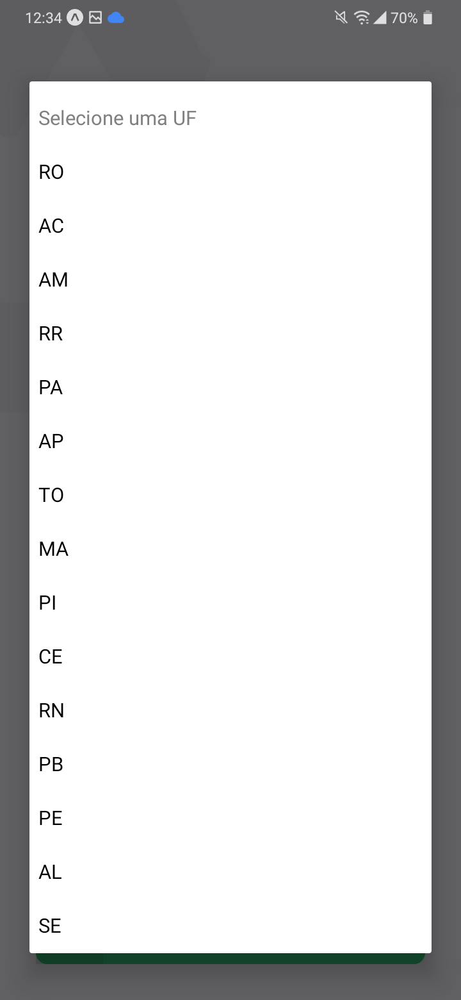</img>

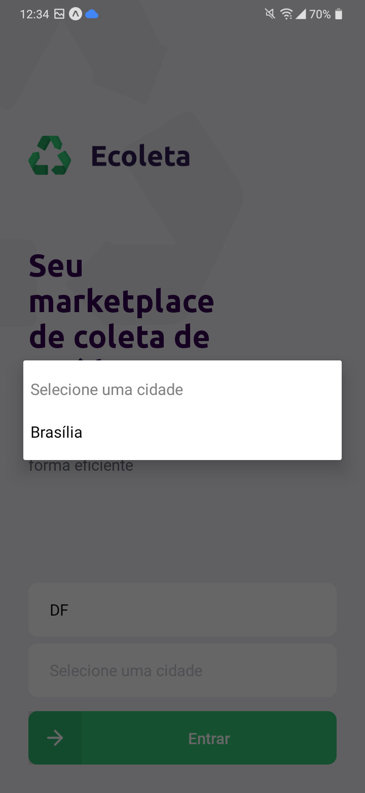</img>

**Página do mapa contendo os pontos de coleta:**

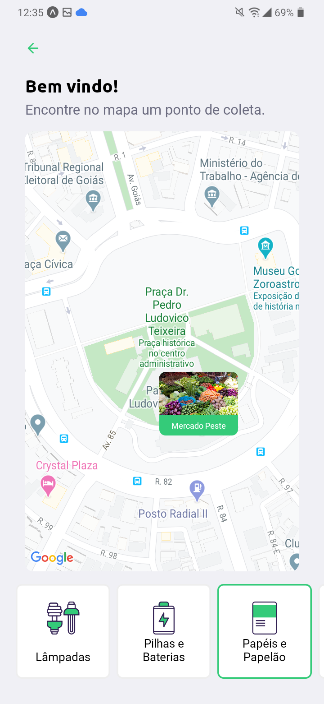</img>

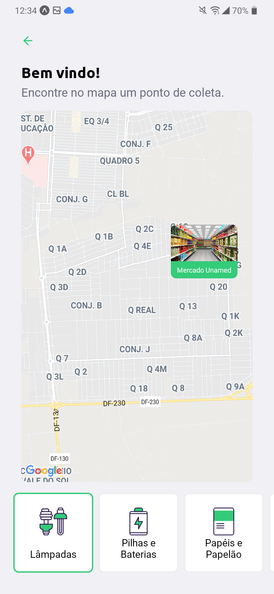</img>

# Desafios

Criar uma tela ao concluir o cadastro: &#10003;

Integrar API do IBGE no mobile para filtrar cidades e estados: &#10003;
